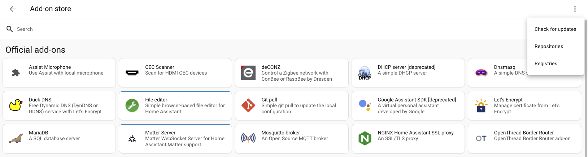

# How to make the existing Daikin Smart AC device Matter Compatible?

## Process Overview
1. Add your Daikin Smart AC to Home Assistant.  
2. Install the Matter Bridge add-on. This add-on connects to your Home Assistant instance and can expose your entities to a Matter fabric.  
3. Configure the add-on. Install `matterbridge-hass` companion plugin and optionally configure devices or entities (in this case, your AC) you want to make visible via Matter.  
4. Pair Matter Bridge with a Matter controller. Use a Matter-enabled app (like Google Home, Apple Home, or Amazon Alexa) to commission the bridge, and your AC will appear as a native device in that app.  

---

## Step 1: Add your Smart AC to Home Assistant
- Open Daikin Smart AC app. Go to **Main Menu → Integration → Home Assistant**. Follow the instructions.  
- For detailed instructions, refer to:  
  [Daikin HA Custom Integration](https://github.com/daikin-br/ha-custom-integration)  

---

## Step 2: Install and Configure Matterbridge

For detailed instructions, follow:  
[Matterbridge Home Assistant Add-on](https://github.com/Luligu/matterbridge-home-assistant-addon)  

### 1. Add the Matterbridge repository
- In Home Assistant, go to **Settings → Add-ons**.  
- Click the **three-dot menu** in the top-right corner and select **Repositories**.

- Paste the URL for the Matterbridge add-on repository:  
  `https://github.com/Luligu/matterbridge-home-assistant-addon`  

### 2. Install the Matterbridge add-on
- After adding the repository, search for the **Matterbridge** add-on in the add-on store and click **Install**.  
- Once installed, enable **Start on boot** and **Watchdog** for reliability, then click **Start**.  
- Go to **Matter Bridge Web UI** → select **matterbridge-hass** from the plugin list → click **Install**.  
  - This plugin allows Home Assistant devices and individual entities to be exposed to the Matter ecosystem.  

---

## Step 3: Configure the Add-on

### 1. Configure `matterbridge-hass` companion plugin
- Once installed, click the **gear icon** to setup `matterbridge-hass`.  
- Setup **Home Assistant Long-Lived Access Token** for `matterbridge-hass` to establish a WebSocket connection with Home Assistant.  
  - To generate this token:  
    - Click on your account → **Security**.  
    - Navigate to **Long-Lived Access Token** section.  
    - Click on **Create Token**.  
- Restart the MatterBridge as required to complete the setup.  
- On successful completion, you will see the list of Home Assistant devices that will be exposed to the Matter ecosystem via Matter Bridge.  

---

## Step 4: Pair / Commission Matterbridge to Your Matter Ecosystem

### 1. Prepare for pairing
- Open the Matterbridge Web UI in Home Assistant.  
- Locate the **Matter onboarding QR code** on the main interface.  

### 2. Add Matterbridge to your ecosystem
- Open the smart home app you want to use (e.g., Google Home, Alexa, or Apple Home).  
- Start the **Add Device** process for a Matter device.  
- Use your phone’s camera to scan the **QR code** from the Matterbridge Web UI.  
- Follow the on-screen instructions in the app to pair the Home Assistant bridge.  
- You may see a warning that it is an **“uncertified”** device; you can safely proceed.  

### 3. Control your AC
- Once commissioned, your non-Matter AC will appear in your Matter-compatible app (e.g., Google Home) as a **climate device**.  
- You can now control its basic functions (on/off, temperature) via your Matter ecosystem.  

---
