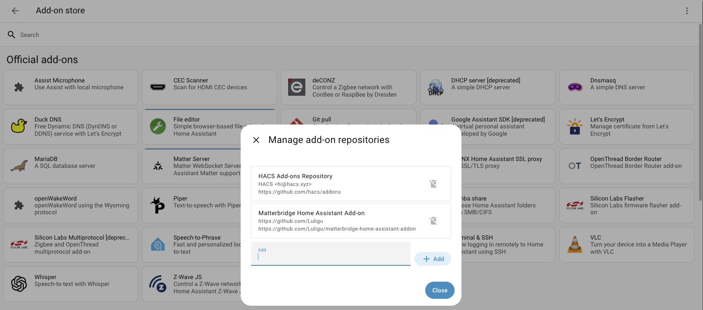
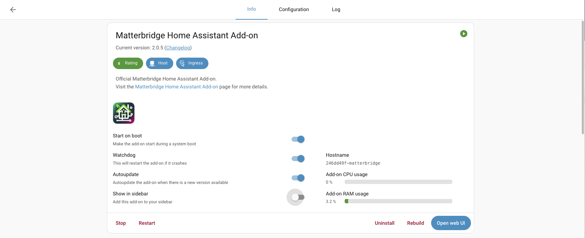
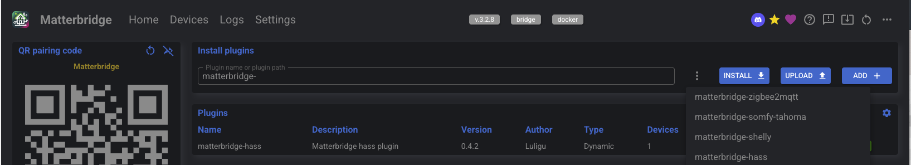
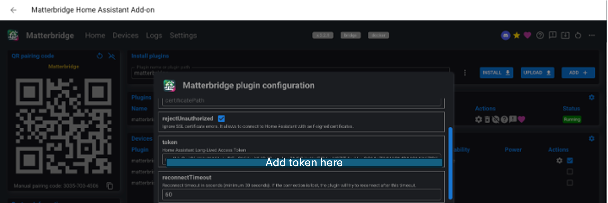

# Como tornar o dispositivo Daikin Smart AC existente compatível com Matter?

## Visão Geral do Processo
1. Adicione seu Daikin Smart AC ao Home Assistant.  
2. Instale o add-on **Matter Bridge**. Este add-on conecta-se à sua instância do Home Assistant e pode expor suas entidades para uma rede Matter.  
3. Configure o add-on. Instale o plugin complementar `matterbridge-hass` e, opcionalmente, configure os dispositivos ou entidades (neste caso, seu AC) que deseja tornar visíveis via Matter.  
4. Emparelhe o Matter Bridge com um controlador Matter. Use um aplicativo compatível com Matter (como Google Home, Apple Home ou Amazon Alexa) para comissionar a bridge, e seu AC aparecerá como um dispositivo nativo nesse aplicativo.  

---

## Passo 1: Adicione seu Smart AC ao Home Assistant
- Abra o aplicativo **Daikin Smart AC**. Vá em **Menu Principal → Integração → Home Assistant**. Siga as instruções.  
- Para instruções detalhadas, consulte:  
  [Daikin HA Custom Integration](https://github.com/daikin-br/ha-custom-integration)  

---

## Passo 2: Instale e Configure o Matterbridge

Para instruções detalhadas, consulte:  
[Matterbridge Home Assistant Add-on](https://github.com/Luligu/matterbridge-home-assistant-addon)  

### 1. Adicione o repositório do Matterbridge
- No Home Assistant, vá em **Configurações → Add-ons**.  
- Clique no **menu de três pontos** no canto superior direito e selecione **Repositórios**.  

- Cole a URL do repositório do add-on Matterbridge:  
  `https://github.com/Luligu/matterbridge-home-assistant-addon`  

### 2. Instale o add-on Matterbridge
- Após adicionar o repositório, procure pelo add-on **Matterbridge** na loja de add-ons e clique em **Instalar**.  
- Depois da instalação, habilite **Iniciar na inicialização (Start on boot)** e **Watchdog** para maior confiabilidade, em seguida clique em **Iniciar**.  
- Vá até a **Web UI do Matter Bridge** → selecione **matterbridge-hass** na lista de plugins → clique em **Instalar**.  
  - Este plugin permite expor dispositivos e entidades individuais do Home Assistant ao ecossistema Matter.  

---

## Passo 3: Configure o Add-on

### 1. Configure o plugin complementar `matterbridge-hass`
- Após a instalação, clique no **ícone de engrenagem** para configurar o `matterbridge-hass`.  
- Configure um **Token de Acesso de Longa Duração do Home Assistant** para que o `matterbridge-hass` estabeleça uma conexão WebSocket com o Home Assistant.  

  - Para gerar este token:  
    - Clique em sua conta → **Segurança**.  
    - Vá até a seção **Token de Acesso de Longa Duração (Long-Lived Access Token)**.  
    - Clique em **Criar Token**.  
- Reinicie o MatterBridge, se necessário, para concluir a configuração.  
- Após a conclusão bem-sucedida, você verá a lista de dispositivos do Home Assistant que serão expostos ao ecossistema Matter via Matter Bridge.  

---

## Passo 4: Emparelhe / Comissione o Matterbridge ao seu Ecossistema Matter

### 1. Preparação para emparelhamento
- Abra a **Web UI do Matterbridge** no Home Assistant.  
- Localize o **QR Code de onboarding Matter** na interface principal.  

### 2. Adicione o Matterbridge ao seu ecossistema
- Abra o aplicativo de casa inteligente que deseja usar (por exemplo, Google Home, Alexa ou Apple Home).  
- Inicie o processo de **Adicionar Dispositivo** para um dispositivo Matter.  
- Use a câmera do seu celular para escanear o **QR Code** da Web UI do Matterbridge.  
- Siga as instruções na tela do aplicativo para emparelhar a bridge do Home Assistant.  
- Você pode ver um aviso de que este é um dispositivo **“não certificado”**; é seguro prosseguir.  

### 3. Controle seu AC
- Uma vez comissionado, seu AC não-Matter aparecerá em seu aplicativo compatível com Matter (por exemplo, Google Home) como um **dispositivo de climatização**.  
- Agora você pode controlar suas funções básicas (ligar/desligar, temperatura) através do seu ecossistema Matter.  

---
